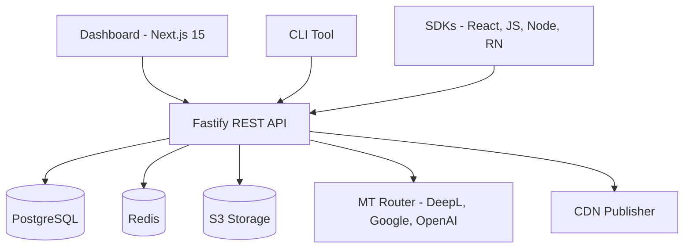

# i18n-platform

**Self-hosted i18n automation — an open-source alternative to Crowdin and Lokalise.**

[](./LICENSE)
[](#packages)
[](#packages)

---

## What is this?

i18n-platform is a production-grade, fully self-hosted internationalization platform you can run on your own infrastructure. It ships a web dashboard for translator collaboration, SDKs for React, Vanilla JS, Node.js, and React Native, a developer CLI for extract/push/pull/validate workflows, and an AI-powered machine translation layer with smart provider routing and quality scoring — all in a single monorepo.

---

## Features

- **Web dashboard** — translator workspace with a rich editor, review workflow, import/export, and project-level statistics
- **SDK suite** — first-class clients for React (hooks + context), Vanilla JS, Node.js, and React Native
- **CLI toolchain** — `extract`, `push`, `pull`, `sync`, `validate`, `codegen` commands for any CI pipeline
- **7 file formats** — JSON flat, JSON nested, YAML, PO, XLIFF, Android XML, iOS `.strings`
- **AI / MT layer** — pluggable provider routing (DeepL, Google, OpenAI, Claude, Azure) with quality scoring and fallback chains
- **Multi-tenant RBAC** — organizations, projects, and fine-grained roles (owner, admin, developer, translator, reviewer)
- **3 delivery modes** — live REST API, edge CDN publishing, and bundled static output
- **Full audit trail** — every translation change is versioned and attributable
- **Docker Compose** — one command to stand up the full stack locally

---

## Architecture



---

## Packages

| Package | Description | Tests |
|---|---|---|
| `@i18n-platform/core` | Types, interfaces, 17 adapters, Zod schemas, errors | 310 |
| `@i18n-platform/database` | Drizzle ORM schema (15 tables), migrations, seed | 15 |
| `@i18n-platform/api` | Fastify REST API — auth, orgs, projects, translations, MT, import/export | 149 |
| `@i18n-platform/cli` | Developer CLI — extract, push, pull, sync, validate, codegen, status, diff, ci | 20 |
| `@i18n-platform/sdk-js` | Framework-agnostic JS SDK with interpolation, pluralization, 3 providers | 63 |
| `@i18n-platform/sdk-react` | React SDK — `I18nProvider`, `useTranslation`, `Trans`, `LocaleSwitcher` | 25 |
| `@i18n-platform/sdk-node` | Node.js SDK — Express/Fastify middleware, Accept-Language detection | 18 |
| `@i18n-platform/sdk-react-native` | React Native SDK with AsyncStorage offline cache, device locale | 14 |
| `@i18n-platform/cdn-publisher` | Versioned bundle generation and S3/R2 CDN publishing | 38 |
| `@i18n-platform/dashboard` | Next.js 15 web dashboard — translation editor, stats, import/export | 28 |
| **Total** | | **680** |

---

## Quick Start

### Prerequisites

- Node.js >= 20
- pnpm >= 9
- Docker + Docker Compose

### Run locally

```bash
git clone https://github.com/ayush-jadaun/i18n.git
cd i18n
pnpm install
docker compose up -d
pnpm build
pnpm test
```

The API runs at `http://localhost:3000` and the dashboard at `http://localhost:3001`.

---

## SDK Usage

### React

```tsx
import { I18nProvider, useTranslation } from '@i18n-platform/sdk-react';

function App() {
  return (
    <I18nProvider config={{ projectId: 'my-project', defaultLocale: 'en', delivery: 'bundled', translations: { en, fr } }}>
      <Greeting />
    </I18nProvider>
  );
}

function Greeting() {
  const { t, setLocale } = useTranslation();
  return (
    <>
      <h1>{t('greeting', { name: 'World' })}</h1>
      <button onClick={() => setLocale('fr')}>Fran&ccedil;ais</button>
    </>
  );
}
```

### Node.js

```ts
import { createI18nServer } from '@i18n-platform/sdk-node';

const i18n = await createI18nServer({
  projectId: 'my-project',
  defaultLocale: 'en',
  supportedLocales: ['en', 'fr', 'de'],
  delivery: 'bundled',
  translations: { en, fr, de },
});

// Express middleware
app.use(i18n.middleware());
app.get('/hello', (req, res) => res.json({ message: req.t('greeting') }));
```

### Vanilla JS

```ts
import { createI18n } from '@i18n-platform/sdk-js';

const i18n = createI18n({
  projectId: 'my-project',
  defaultLocale: 'en',
  delivery: 'cdn',
  cdnUrl: 'https://cdn.example.com/i18n',
});

console.log(i18n.t('greeting', { name: 'World' }));
```

---

## CLI Usage

```bash
i18n init                          # Initialize config file
i18n extract --source ./src        # Extract keys from source code
i18n push                          # Push keys to the platform
i18n pull --locale fr,de,ja        # Pull translations
i18n sync                          # Push + pull in one step
i18n validate                      # Check coverage and consistency
i18n codegen --output ./src/i18n   # Generate TypeScript types
i18n status                        # Show coverage per locale
i18n diff                          # Show local vs remote changes
i18n ci --min-coverage 95          # CI gate (exits non-zero if below threshold)
```

---

## Tech Stack

| Layer | Technology |
|---|---|
| Language | TypeScript 5 (strict mode) |
| API Server | Fastify 5 |
| Dashboard | Next.js 15 (App Router) |
| ORM | Drizzle ORM |
| Database | PostgreSQL 16 |
| Cache / Queue | Redis 7 |
| Validation | Zod |
| Monorepo | Turborepo + pnpm workspaces |
| Testing | Vitest + K6 |
| Containerization | Docker Compose |

---

## Documentation

| Document | Description |
|---|---|
| [`docs/HLD.md`](./docs/HLD.md) | High-level design — architecture, data flows, deployment |
| [`docs/LLD.md`](./docs/LLD.md) | Low-level design — schema, API contracts, adapter pattern |
| [`docs/guides/getting-started.md`](./docs/guides/getting-started.md) | Step-by-step setup guide |
| [`docs/guides/cli.md`](./docs/guides/cli.md) | Full CLI reference |
| [`docs/guides/deployment.md`](./docs/guides/deployment.md) | Production deployment guide |

---

## Examples

| Example | Stack |
|---|---|
| [`examples/nextjs-app-router`](./examples/nextjs-app-router) | Next.js 15 App Router |
| [`examples/react-vite-spa`](./examples/react-vite-spa) | React + Vite SPA |
| [`examples/express-server`](./examples/express-server) | Express.js server-side |
| [`examples/vanilla-html`](./examples/vanilla-html) | Plain HTML + JS |
| [`examples/email-templates`](./examples/email-templates) | Email i18n with Node SDK |

---

## Project Structure

```
i18n/
├── packages/
│   ├── core/               # Types, interfaces, adapters, schemas
│   ├── database/           # Drizzle schema, migrations, seed
│   ├── api/                # Fastify REST API
│   ├── cli/                # Developer CLI
│   ├── sdk-js/             # Framework-agnostic JS SDK
│   ├── sdk-react/          # React SDK
│   ├── sdk-node/           # Node.js SDK
│   ├── sdk-react-native/   # React Native SDK
│   ├── cdn-publisher/      # CDN bundle publisher
│   └── dashboard/          # Next.js 15 web dashboard
├── apps/
│   └── cdn-publisher/      # CDN publisher worker
├── examples/               # Runnable example projects
├── docs/                   # HLD, LLD, and guides
├── k6/                     # K6 performance test scripts
├── docker-compose.yml
├── turbo.json
└── pnpm-workspace.yaml
```

---

## License

[Apache License 2.0](./LICENSE)
