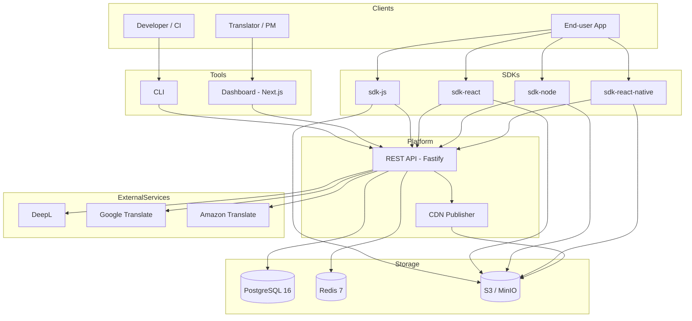
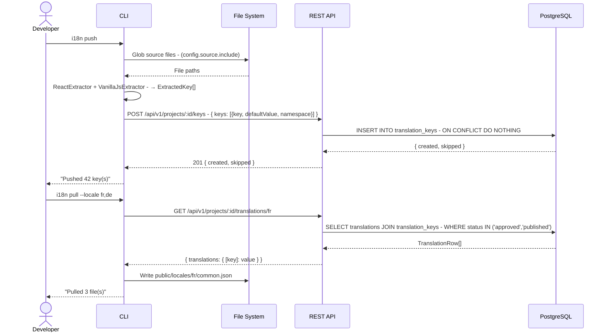
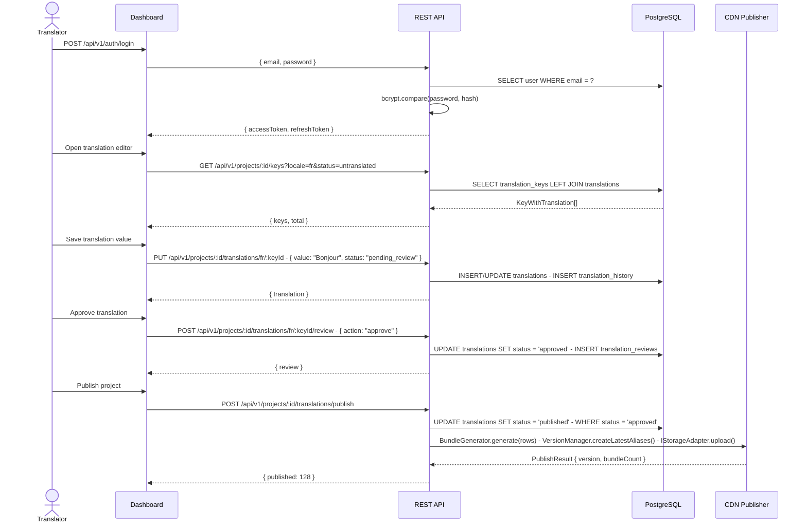
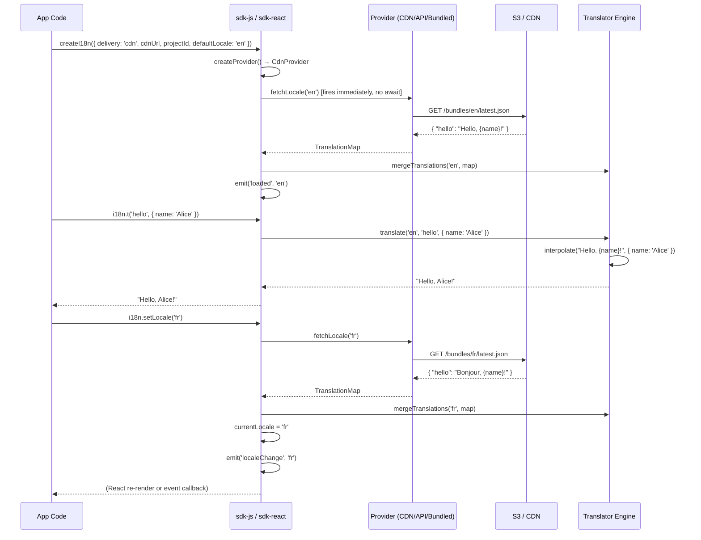

# High-Level Design — i18n-platform

> Self-hosted internationalization platform: a Crowdin / Lokalise alternative built as a TypeScript monorepo with 10 packages covering the full translation lifecycle from key extraction to CDN delivery.

---

## Table of Contents

1. [Introduction](#1-introduction)
2. [System Architecture](#2-system-architecture)
3. [Component Overview](#3-component-overview)
4. [Data Flow](#4-data-flow)
5. [Tech Stack](#5-tech-stack)
6. [Deployment](#6-deployment)
7. [Security](#7-security)
8. [Non-Functional Requirements](#8-non-functional-requirements)

---

## 1. Introduction

**i18n-platform** is a production-grade, self-hosted translation management system. It replaces SaaS tools like Crowdin, Lokalise, and Phrase with an open, privacy-respecting alternative that teams can run on their own infrastructure.

### Core capabilities

| Capability | Description |
|---|---|
| Key management | Extract, push, and version translation keys from source code |
| Translator workflow | Web dashboard with review, approve, and reject actions |
| Machine translation | Pluggable MT providers (DeepL, Google, AWS) with quality scoring |
| CDN delivery | Versioned JSON bundles published to S3-compatible object storage |
| SDK integration | JavaScript, React, Node.js, and React Native SDKs |
| CLI tooling | 10-command CLI for CI pipelines and developer workflows |

### Monorepo layout

```
i18n-platform/
├── packages/
│   ├── core          # Shared types, interfaces, adapters, error hierarchy
│   ├── database      # Drizzle ORM schema (15 tables), migrations, seed
│   ├── api           # Fastify REST API (40+ endpoints, 149 tests)
│   ├── cli           # Commander CLI tool (10 commands)
│   ├── sdk-js        # Vanilla-JS SDK
│   ├── sdk-react     # React hooks and context provider
│   ├── sdk-node      # Node.js server-side SDK
│   ├── sdk-react-native  # React Native SDK
│   └── dashboard     # Next.js web application
└── apps/
    └── cdn-publisher # CDN bundle generator and S3 uploader
```

---

## 2. System Architecture



### Key architectural decisions

- **Monorepo with Turborepo** — shared build graph, incremental caching, and consistent versioning across all packages.
- **Adapter pattern throughout** — every integration point (format, storage, MT, cache, notification) is hidden behind an interface so implementations can be swapped without touching business logic.
- **Stateless API** — the Fastify server is stateless; all state lives in PostgreSQL and Redis, making horizontal scaling straightforward.
- **CDN-first delivery** — SDKs prefer fetching from S3/CDN for low-latency reads; the API is only hit for writes and authenticated reads.

---

## 3. Component Overview

### `@i18n-platform/core`

The foundation shared by every other package. Exports the complete TypeScript type system (15+ domain types), the interface contracts that all adapters must implement (`IFormatAdapter`, `IMachineTranslator`, `IStorageAdapter`, `ICacheAdapter`, `IKeyExtractor`, `INotificationAdapter`, `ITranslationProvider`), concrete adapter implementations (JSON-flat, JSON-nested, YAML, PO, XLIFF, Android XML, iOS Strings, Redis cache, S3 storage, email/Slack/webhook notifications, React and vanilla-JS extractors), Zod validation schemas for every API request, and the typed error hierarchy (`I18nError` → `NotFoundError` | `ValidationError` | `AuthenticationError` | `AuthorizationError` | `ConflictError` | `RateLimitError` | `ExternalServiceError`). The package is deliberately dependency-light so SDKs can import it without bundle bloat. It ships 310 tests.

### `@i18n-platform/database`

All persistence concerns in one place. Defines 15 Drizzle ORM table schemas for PostgreSQL with full TypeScript inference. Provides a typed `Database` connection type exported for use by the API service layer, a database seeder (`seed.ts`) that bootstraps a demo organization and project, and the Drizzle relation graph (`relations.ts`) used for type-safe joins. Migrations are generated by Drizzle Kit and stored under `drizzle/`.

### `@i18n-platform/api`

The central HTTP server built on Fastify. Implements 40+ REST endpoints organized into eight route groups, JWT-based authentication with token rotation, API-key authentication for SDK/CDN access, request validation via Zod schemas from `@i18n-platform/core`, a typed service layer that sits between routes and the database, and an adapter-based machine translation pipeline. Exposes health checks, structured JSON logging via pino, and configures CORS from environment variables. Ships 149 integration tests run with Vitest.

### `@i18n-platform/cli`

A developer-facing command-line tool built with Commander.js. Reads project configuration from `i18n.config.ts`, communicates with the API via a typed `ApiClient`, and supports 10 commands covering the full developer workflow: `init`, `extract`, `push`, `pull`, `sync`, `validate`, `codegen`, `status`, `diff`, and `ci`. The `codegen` command generates TypeScript union types from live translation keys, enabling compile-time key safety. The `ci` command exits non-zero when coverage falls below a configurable threshold, making it suitable for GitHub Actions and other CI pipelines.

### `@i18n-platform/sdk-js`

A framework-agnostic JavaScript SDK. Creates an `I18nInstance` via `createI18n()` that wraps a `Translator` engine (supporting `{param}` interpolation and ICU plural expressions) with a pluggable `ITranslationProvider`. Supports three delivery modes: `api` (direct REST calls with API key), `cdn` (fetch from S3/CDN URL), and `bundled` (pre-bundled JSON passed at initialization). Exposes `on('localeChange')` and `on('loaded')` events. Deduplicates concurrent locale loads via in-flight promise tracking.

### `@i18n-platform/sdk-react`

React bindings built on top of `sdk-js`. Provides an `<I18nProvider>` context component, a `useTranslation(namespace?)` hook that returns `{ t, locale, setLocale, isLoading }`, and a `<Trans>` component for rendering translations with embedded React nodes. Namespace scoping prepends the namespace prefix to all key lookups automatically. Re-renders are triggered on locale change via React state.

### `@i18n-platform/sdk-node`

A Node.js SDK variant optimized for server-side rendering, SSG, and background jobs. Shares the same `Translator` core as `sdk-js` but adapts to server-only concerns: synchronous initialization from bundled translations, optional Redis caching for API-mode fetches, and stream-compatible output.

### `@i18n-platform/sdk-react-native`

A React Native SDK that reuses the `sdk-react` hooks but replaces web-only APIs with React Native equivalents and supports AsyncStorage for offline caching of translation bundles.

### `apps/cdn-publisher`

A standalone Node.js application (not exposed as an HTTP server) that is invoked after translations are approved and published. Its three components work in sequence: `BundleGenerator` groups translation rows from the database into per-locale, per-namespace JSON objects; `VersionManager` stamps each bundle with a monotonically-increasing timestamp version (`v${Date.now()}`) and generates stable `latest.json` alias bundles; `CdnPublisher` uploads all bundles to the configured `IStorageAdapter` (S3 in production, MinIO in development). Returns a `PublishResult` summarizing bundle and alias counts and upload metadata.

### `@i18n-platform/dashboard`

A Next.js web application (App Router) serving as the visual translation management interface. Provides organization and project management screens, a translation editor with search, filter, and bulk-edit capabilities, a coverage dashboard showing per-locale progress bars, an audit log viewer, API key management, and MT configuration screens. Authenticates against the API using JWT tokens stored in HTTP-only cookies.

---

## 4. Data Flow

### 4.1 Developer Workflow (Extract → Push → Translate → Pull)



### 4.2 Translator Workflow (Login → Translate → Review → Publish)



### 4.3 SDK Runtime (Init → Load → Render → Switch Locale)



---

## 5. Tech Stack

| Layer | Technology | Version | Notes |
|---|---|---|---|
| Language | TypeScript | 5.7 | Strict mode, ESM |
| Runtime | Node.js | ≥ 20 | Native `fetch`, `glob`, `crypto` |
| Build system | Turborepo | 2.3 | Incremental build caching |
| Package manager | pnpm | 9.15 | Workspace protocol |
| API framework | Fastify | 4.x | Plugins: jwt, cors, multipart |
| ORM | Drizzle ORM | 0.36 | Type-safe SQL builder |
| Database | PostgreSQL | 16 | JSONB for preferences/settings |
| Cache / Rate limit | Redis | 7 | ioredis client |
| Object storage | AWS S3 / MinIO | — | S3-compatible API |
| Validation | Zod | 3.x | Schemas in `@i18n-platform/core` |
| CLI framework | Commander.js | 12 | Ora spinners, chalk |
| Frontend | Next.js | 15 | App Router, RSC |
| Styling | Tailwind CSS | 3.x | |
| Testing | Vitest | 2.1 | 460+ tests across packages |
| MT providers | DeepL / Google / AWS | — | Via `IMachineTranslator` adapters |
| Email | Nodemailer + Mailpit | — | Dev: Mailpit SMTP |
| Containerization | Docker / Docker Compose | — | Postgres, Redis, MinIO, Mailpit |
| Bundler | tsup | 8.3 | ESM + CJS dual output |

---

## 6. Deployment

### 6.1 Local Development (Docker Compose)

The repository ships a `docker-compose.yml` at the root that starts all infrastructure services. The API and dashboard run as Node.js processes on the host.

```
Services:
  postgres  → localhost:5432  (data: .docker-data/postgres)
  redis     → localhost:6379  (data: .docker-data/redis)
  minio     → localhost:9000  (API), localhost:9001 (console)
  mailpit   → localhost:8025  (web UI), localhost:1025 (SMTP)
```

Start services, run migrations, and launch the API:

```bash
docker compose up -d
pnpm db:migrate
pnpm db:seed
pnpm --filter @i18n-platform/api dev
pnpm --filter @i18n-platform/dashboard dev
```

### 6.2 Production — Containerized (Recommended)

Build Docker images for the API and dashboard:

```
Container: i18n-api
  Base: node:20-alpine
  Entrypoint: node dist/server.js
  Ports: 3000
  Env: DATABASE_URL, REDIS_URL, JWT_SECRET, ...

Container: i18n-dashboard
  Base: node:20-alpine / Next.js standalone output
  Ports: 3001
  Env: NEXT_PUBLIC_API_URL, ...

External services:
  PostgreSQL 16 (RDS, Cloud SQL, Neon, etc.)
  Redis 7       (ElastiCache, Upstash, etc.)
  S3 bucket     (AWS S3, Cloudflare R2, etc.)
```

### 6.3 Production — Hybrid (Vercel + Docker)

| Component | Host |
|---|---|
| Dashboard (`@i18n-platform/dashboard`) | Vercel (Next.js) |
| API (`@i18n-platform/api`) | Docker on any VPS / Kubernetes |
| PostgreSQL | Managed DB (Neon, Supabase, RDS) |
| Redis | Upstash or ElastiCache |
| S3 | Cloudflare R2 or AWS S3 |

Set `NEXT_PUBLIC_API_URL` in Vercel environment variables to point the dashboard at the deployed API origin.

---

## 7. Security

### Authentication

| Mechanism | Used by | Details |
|---|---|---|
| JWT (Bearer) | Dashboard, CLI | HS256, 15-minute access token + 7-day refresh token with rotation |
| API Key | SDKs, CI pipelines | `i18n_<64-hex-chars>`, stored as bcrypt hash, identified by 8-char prefix |

All JWT tokens are signed with `JWT_SECRET` (minimum 16 characters, validated at startup by Zod). Refresh token rotation invalidates the old token on each `POST /api/v1/auth/refresh` call.

API keys are generated with `crypto.randomBytes(32)`, hashed with bcrypt (10 rounds), and the full raw key is returned **only once** at creation time. Subsequent list requests expose only the prefix for identification.

### RBAC

Organization members carry a `role` field (`owner` | `admin` | `developer` | `translator` | `viewer`) plus a fine-grained JSON `permissions` bag for per-project overrides. API key scopes (e.g., `translations:read`, `translations:write`) restrict programmatic access further.

### Input Validation

Every request body and query string is parsed through a Zod schema from `@i18n-platform/core` before it reaches any service function. Failed validation returns `400 VALIDATION_ERROR` with structured field-level errors before any database interaction.

### Data Protection

- Passwords: hashed with bcrypt (10+ rounds) — plain-text passwords are never stored or logged.
- API keys: hashed with bcrypt — raw keys are never stored.
- Audit log: every significant mutation is recorded in `audit_log` with old/new JSON snapshots and the user's IP address.

### Transport

HTTPS is required in production. The API enforces CORS via the `CORS_ORIGINS` environment variable. Fastify's built-in XSS and CSRF protections are enabled via Helmet-equivalent plugin settings.

---

## 8. Non-Functional Requirements

| Requirement | Target | Measurement |
|---|---|---|
| API p95 response time | < 100 ms | k6 load test at 50 VUs |
| API p99 response time | < 250 ms | k6 load test at 50 VUs |
| SDK translation lookup (`t()`) | < 1 ms | In-memory, synchronous |
| SDK locale switch (CDN mode) | < 500 ms | Network + parse overhead |
| CDN bundle fetch (cached) | < 50 ms | S3 + CDN edge cache |
| API throughput | > 500 req/s | k6 stress test |
| Database query p95 | < 20 ms | Drizzle + indexed queries |
| Test coverage | ≥ 90% line | Vitest (460+ tests) |
| Maximum bundle size (sdk-js) | < 10 KB gzip | tsup tree-shaking |
| Concurrent locale loads | Deduplicated | In-flight promise map |
| MT batch job timeout | 30 s | Per-job limit in MT service |
| API key lookup | O(1) by prefix | `api_keys_key_prefix_idx` |
