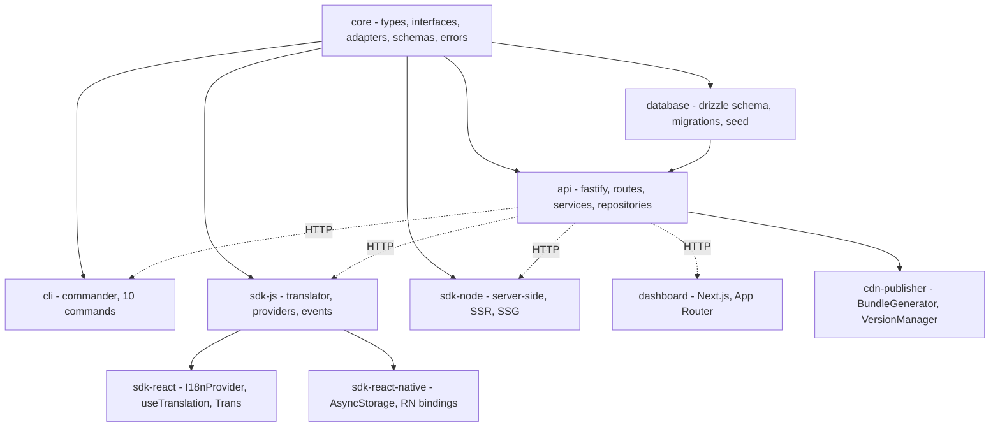
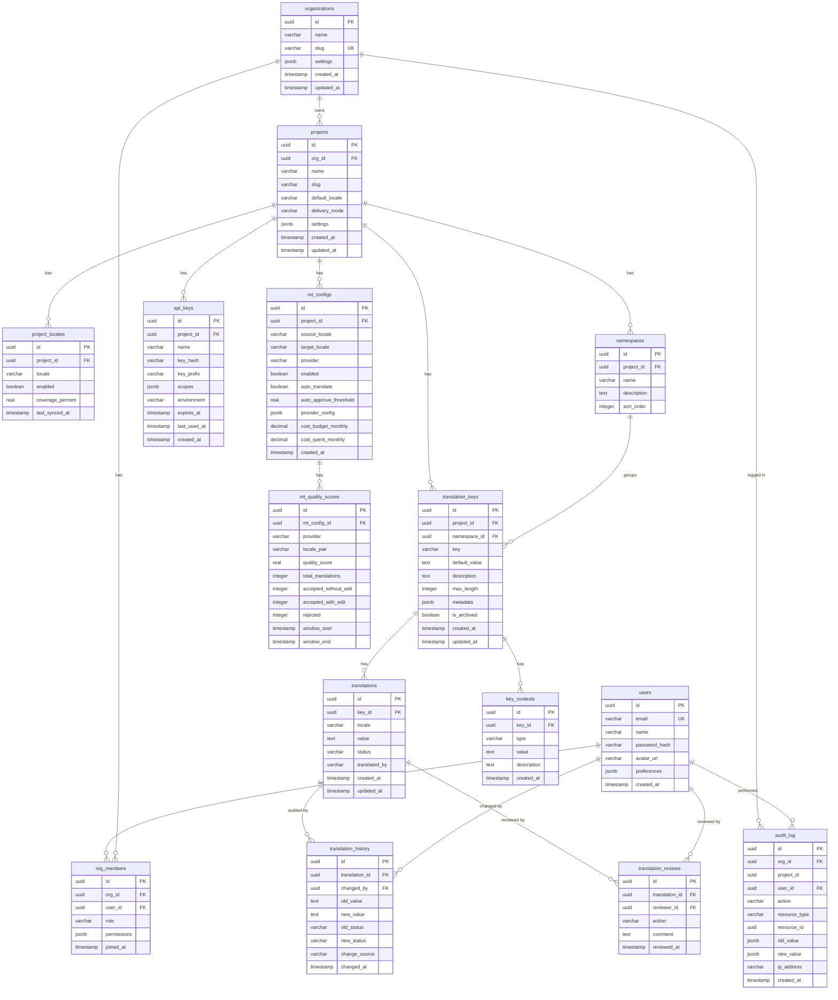
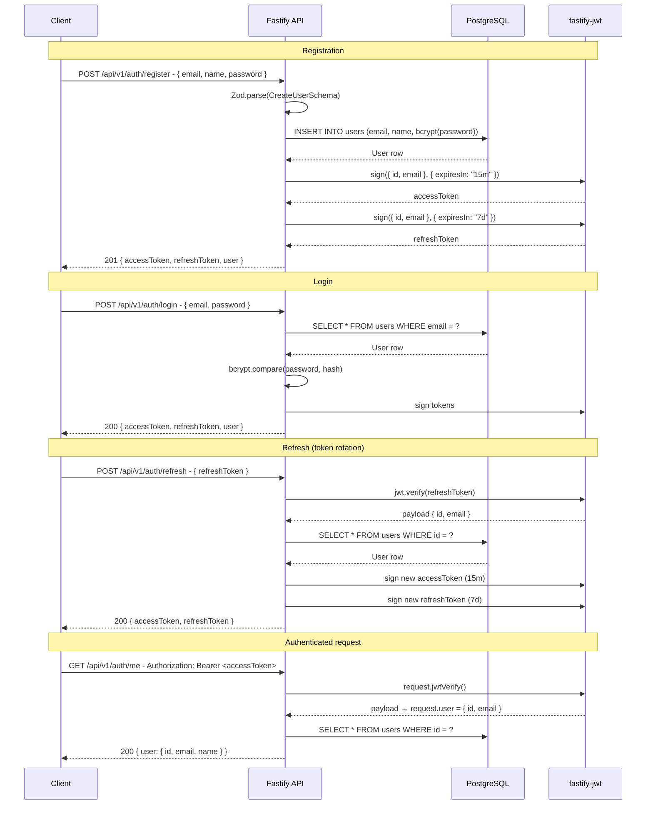
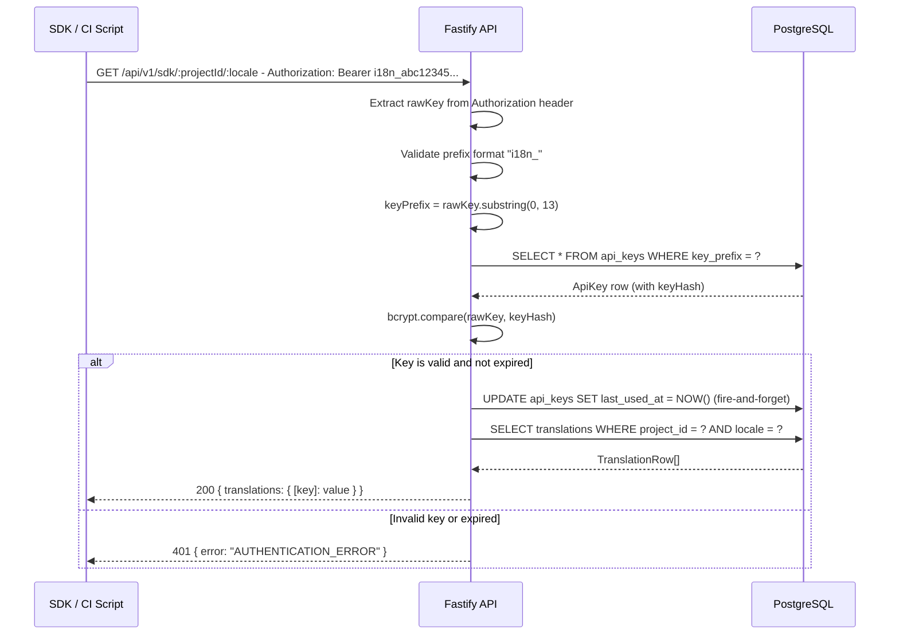
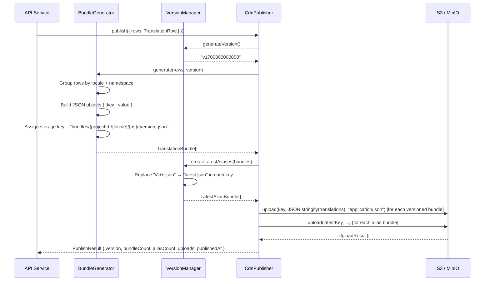
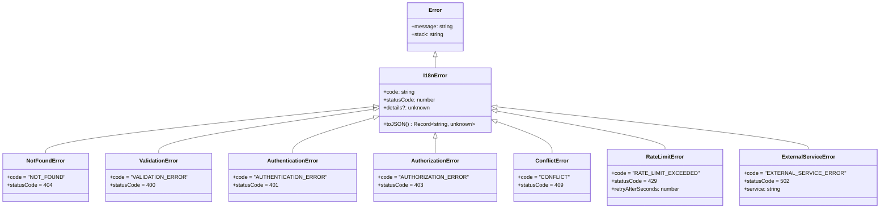

# Low-Level Design — i18n-platform

> Detailed technical design covering database schema, API contract, adapter internals, translation engine, auth flows, MT pipeline, CDN publishing, and error handling.

---

## Table of Contents

1. [Package Dependency Graph](#1-package-dependency-graph)
2. [Database Schema](#2-database-schema)
3. [API Endpoints](#3-api-endpoints)
4. [Adapter Pattern](#4-adapter-pattern)
5. [Translation Engine](#5-translation-engine)
6. [Auth Flow](#6-auth-flow)
7. [MT Pipeline](#7-mt-pipeline)
8. [CDN Publishing](#8-cdn-publishing)
9. [Error Handling](#9-error-handling)

---

## 1. Package Dependency Graph



Solid arrows indicate compile-time package dependencies (via `workspace:*` in `pnpm`). Dashed arrows indicate runtime HTTP communication.

---

## 2. Database Schema

### Entity-Relationship Diagram



### Key indexes

| Table | Index | Columns | Purpose |
|---|---|---|---|
| `users` | `users_email_idx` | `email` (unique) | Login lookup |
| `organizations` | `organizations_slug_idx` | `slug` (unique) | URL routing |
| `projects` | `projects_org_slug_idx` | `(org_id, slug)` (unique) | Slug uniqueness per org |
| `translation_keys` | `translation_keys_project_key_idx` | `(project_id, key)` (unique) | Prevent duplicate keys |
| `translations` | `translations_key_locale_idx` | `(key_id, locale)` (unique) | One translation per key per locale |
| `translations` | `translations_status_idx` | `status` | Filter by workflow state |
| `api_keys` | `api_keys_key_prefix_idx` | `key_prefix` | O(1) lookup during SDK auth |
| `audit_log` | `audit_log_created_at_idx` | `created_at` | Efficient time-range queries |

### Translation workflow states

```
untranslated → draft → pending_review → approved → published
                                      ↘ rejected → draft
```

---

## 3. API Endpoints

All endpoints are prefixed with `/api/v1`. JWT endpoints require `Authorization: Bearer <access_token>`. SDK endpoints require `Authorization: Bearer <api_key>` or `?apiKey=<api_key>`.

### Auth (`/api/v1/auth`)

| Method | Path | Auth | Description |
|---|---|---|---|
| `POST` | `/auth/register` | None | Create account → `{ accessToken, refreshToken, user }` |
| `POST` | `/auth/login` | None | Sign in → `{ accessToken, refreshToken, user }` |
| `POST` | `/auth/refresh` | None | Rotate tokens → `{ accessToken, refreshToken }` |
| `GET` | `/auth/me` | JWT | Current user profile → `{ user }` |

### Organizations (`/api/v1/orgs`)

| Method | Path | Auth | Description |
|---|---|---|---|
| `POST` | `/orgs` | JWT | Create org → `201 { organization }` |
| `GET` | `/orgs` | JWT | List user's orgs → `{ organizations[] }` |
| `GET` | `/orgs/:orgId` | JWT | Get org → `{ organization }` |
| `PATCH` | `/orgs/:orgId` | JWT | Update org → `{ organization }` |
| `DELETE` | `/orgs/:orgId` | JWT | Delete org → `204` |
| `POST` | `/orgs/:orgId/members/invite` | JWT | Invite member by email → `201 { member }` |
| `GET` | `/orgs/:orgId/members` | JWT | List members → `{ members[] }` |
| `PATCH` | `/orgs/:orgId/members/:memberId` | JWT | Update member role → `{ member }` |
| `DELETE` | `/orgs/:orgId/members/:memberId` | JWT | Remove member → `204` |

### Projects (`/api/v1`)

| Method | Path | Auth | Description |
|---|---|---|---|
| `POST` | `/orgs/:orgId/projects` | JWT | Create project → `201 { project }` |
| `GET` | `/orgs/:orgId/projects` | JWT | List projects → `{ projects[] }` |
| `GET` | `/projects/:projectId` | JWT | Get project (with locales + namespaces) → `{ project }` |
| `PATCH` | `/projects/:projectId` | JWT | Update project → `{ project }` |
| `DELETE` | `/projects/:projectId` | JWT | Delete project → `204` |
| `POST` | `/projects/:projectId/locales` | JWT | Add locale → `201 { locale }` |
| `DELETE` | `/projects/:projectId/locales/:localeId` | JWT | Remove locale → `204` |
| `POST` | `/projects/:projectId/namespaces` | JWT | Create namespace → `201 { namespace }` |
| `PATCH` | `/projects/:projectId/namespaces/:nsId` | JWT | Update namespace → `{ namespace }` |
| `DELETE` | `/projects/:projectId/namespaces/:nsId` | JWT | Delete namespace → `204` |

### Translation Keys and Translations (`/api/v1/projects/:projectId`)

| Method | Path | Auth | Description |
|---|---|---|---|
| `POST` | `/keys` | JWT | Bulk create/upsert keys → `201 { created[], skipped }` |
| `GET` | `/keys` | JWT | List keys (paginated, filterable) → `{ keys[], total }` |
| `GET` | `/keys/:keyId` | JWT | Get key with all translations → `{ key }` |
| `PATCH` | `/keys/:keyId` | JWT | Update key metadata → `{ key }` |
| `DELETE` | `/keys/:keyId` | JWT | Delete key (cascades to translations) → `204` |
| `GET` | `/translations/:locale` | JWT | All translations for locale → `{ translations: {[key]: value} }` |
| `PUT` | `/translations/:locale/:keyId` | JWT | Set/update a single translation → `{ translation }` |
| `PATCH` | `/translations/bulk` | JWT | Bulk update translations → `{ updated[] }` |
| `POST` | `/translations/:locale/:keyId/review` | JWT | Approve or reject → `{ review }` |
| `POST` | `/translations/publish` | JWT | Publish all approved → `{ published: number }` |

### Machine Translation (`/api/v1/projects/:projectId/mt`)

| Method | Path | Auth | Description |
|---|---|---|---|
| `POST` | `/mt/translate` | JWT | Trigger MT job → `{ translatedCount, providerId }` |
| `GET` | `/mt/config` | JWT | Get MT configurations → `{ configs[] }` |
| `PUT` | `/mt/config` | JWT | Create or update MT config → `{ config }` |

### Import / Export (`/api/v1/projects/:projectId`)

| Method | Path | Auth | Description |
|---|---|---|---|
| `POST` | `/import` | JWT | Import file (JSON/YAML/PO/XLIFF) → `{ created, updated, skipped }` |
| `GET` | `/export` | JWT | Export translations → `{ content, fileExtension, entryCount }` |

### Statistics and Audit (`/api/v1`)

| Method | Path | Auth | Description |
|---|---|---|---|
| `GET` | `/projects/:projectId/stats` | JWT | Project coverage stats → `{ totalKeys, locales[] }` |
| `GET` | `/orgs/:orgId/stats` | JWT | Org aggregate stats → `{ totalProjects, totalKeys, projects[] }` |
| `GET` | `/projects/:projectId/audit` | JWT | Audit log (paginated) → `{ entries[], total }` |

### API Keys (`/api/v1/projects/:projectId/api-keys`)

| Method | Path | Auth | Description |
|---|---|---|---|
| `POST` | `/api-keys` | JWT | Create key → `201 { key: <raw>, apiKey: <record> }` |
| `GET` | `/api-keys` | JWT | List keys (no hashes) → `{ apiKeys[] }` |
| `DELETE` | `/api-keys/:keyId` | JWT | Revoke key → `204` |

### SDK Delivery (`/api/v1/sdk`) — API Key auth

| Method | Path | Auth | Description |
|---|---|---|---|
| `GET` | `/sdk/:projectId/:locale` | API Key | All translations for locale → `{ translations }` |
| `GET` | `/sdk/:projectId/:locale/:namespace` | API Key | Namespace-scoped translations → `{ translations }` |

---

## 4. Adapter Pattern

The adapter pattern decouples the platform from concrete infrastructure and third-party services. All adapters implement interfaces from `packages/core/src/interfaces/`.

```mermaid
classDiagram
    class IFormatAdapter {
        +formatId: string
        +fileExtension: string
        +parse(content: string) TranslationMap
        +serialize(map: TranslationMap, options?) string
        +detect(content: string) boolean
    }

    class JsonFlatAdapter {
        +formatId = "json-flat"
        +fileExtension = ".json"
    }

    class JsonNestedAdapter {
        +formatId = "json-nested"
        +fileExtension = ".json"
    }

    class YamlAdapter {
        +formatId = "yaml"
        +fileExtension = ".yaml"
    }

    class PoAdapter {
        +formatId = "po"
        +fileExtension = ".po"
    }

    class XliffAdapter {
        +formatId = "xliff"
        +fileExtension = ".xliff"
    }

    class AndroidXmlAdapter {
        +formatId = "android-xml"
        +fileExtension = ".xml"
    }

    class IosStringsAdapter {
        +formatId = "ios-strings"
        +fileExtension = ".strings"
    }

    IFormatAdapter <|.. JsonFlatAdapter
    IFormatAdapter <|.. JsonNestedAdapter
    IFormatAdapter <|.. YamlAdapter
    IFormatAdapter <|.. PoAdapter
    IFormatAdapter <|.. XliffAdapter
    IFormatAdapter <|.. AndroidXmlAdapter
    IFormatAdapter <|.. IosStringsAdapter

    class IMachineTranslator {
        +providerId: string
        +supportedLocales: Locale[]
        +translate(params) Promise~TranslateResult~
        +translateBatch(params) Promise~TranslateBatchResult~
        +detectLanguage?(text) Promise~Locale|null~
        +estimateCost?(params) Promise~CostEstimate~
    }

    class NoOpMtAdapter {
        +providerId = "noop"
    }

    class DeepLAdapter {
        +providerId = "deepl"
    }

    IMachineTranslator <|.. NoOpMtAdapter
    IMachineTranslator <|.. DeepLAdapter

    class IStorageAdapter {
        +storageId: string
        +upload(key, data, contentType) Promise~UploadResult~
        +download(key) Promise~Uint8Array~
        +delete(key) Promise~void~
        +getPublicUrl(key) string|null
        +list(prefix) Promise~StorageObject[]~
    }

    class S3StorageAdapter {
        +storageId = "s3"
    }

    class LocalFsStorageAdapter {
        +storageId = "local"
    }

    IStorageAdapter <|.. S3StorageAdapter
    IStorageAdapter <|.. LocalFsStorageAdapter

    class ICacheAdapter {
        +get(key) Promise~T|null~
        +set(key, value, ttlSeconds?) Promise~void~
        +delete(key) Promise~void~
        +clear() Promise~void~
    }

    class RedisCacheAdapter {
        <<uses ioredis>>
    }

    class InMemoryCacheAdapter {
        <<LRU Map>>
    }

    ICacheAdapter <|.. RedisCacheAdapter
    ICacheAdapter <|.. InMemoryCacheAdapter

    class IKeyExtractor {
        +supportedFileTypes: string[]
        +extract(filePaths) Promise~ExtractionResult~
    }

    class ReactExtractor {
        +supportedFileTypes = [".tsx", ".jsx"]
    }

    class VanillaJsExtractor {
        +supportedFileTypes = [".ts", ".js"]
    }

    IKeyExtractor <|.. ReactExtractor
    IKeyExtractor <|.. VanillaJsExtractor
```



### Adding a new adapter

1. Implement the relevant interface from `packages/core/src/interfaces/`.
2. Export from `packages/core/src/adapters/<category>/index.ts`.
3. The platform picks it up at runtime — no changes to service logic.

---

## 5. Translation Engine

The `Translator` class in `packages/sdk-js/src/translator.ts` is the runtime resolution engine used by all SDKs.

### Interpolation — `{name}` tokens

Plain `{param}` tokens are replaced with the matching value from the `params` object. The engine uses a depth-aware brace scanner (not a simple regex) so nested ICU expressions are handled correctly.

```
Template:  "Hello, {name}! You have {count, plural, one {# message} other {# messages}}."
Params:    { name: "Alice", count: 3 }
Result:    "Hello, Alice! You have 3 messages."
```

Resolution order when a key is missing:

1. Exact match in the requested `locale`'s translation map
2. Exact match in the `fallbackLocale`'s translation map (when different)
3. Return the raw key string as-is

### ICU Pluralization — `{count, plural, ...}` expressions

The engine parses the ICU plural syntax using `Intl.PluralRules` for locale-aware category selection:

```
Syntax:  {<variable>, plural, <category> {<branch>} ...}
Example: {count, plural, zero {No items} one {# item} other {# items}}
```

Branch resolution algorithm:

```
1. Extract variable name from expression (before first comma)
2. Confirm "plural" keyword after variable
3. Parse category → text branch map with regex /(\w+)\s*\{([^}]*)\}/g
4. Call Intl.PluralRules(locale).select(count) → category
5. Special case: if count === 0 and explicit "zero" branch exists, use "zero"
6. Look up branch[category] ?? branch["other"] ?? fallback to raw expression
7. Replace "#" tokens in selected branch with the numeric count
```

Supported plural categories: `zero`, `one`, `two`, `few`, `many`, `other` (CLDR standard).

---

## 6. Auth Flow

### 6.1 JWT Register / Login / Refresh



### 6.2 API Key Auth (SDK Delivery)



---

## 7. MT Pipeline

### Provider routing strategies

The `MtRoutingStrategy` type in `packages/core/src/types/mt.ts` defines five strategies:

| Strategy | Description |
|---|---|
| `single` | Always use one fixed provider (simplest setup) |
| `fallback` | Try providers in order; advance to next on failure |
| `cost` | Select the cheapest provider that supports the locale pair |
| `quality` | Select the provider with highest historical quality score for the locale pair |
| `round-robin` | Distribute requests evenly across all configured providers |

### Routing rule evaluation

Rules are matched in ascending `priority` order (lower = first). Each rule can target a `localePattern` glob (e.g., `zh-*`), a `namespacePattern` glob (e.g., `legal-*`), or both. The first matching rule's `providerId` is used. If no rule matches, the strategy's `defaultProviderId` is applied.

### Quality scoring algorithm

The `mt_quality_scores` table stores rolling-window quality metrics per `(mt_config_id, locale_pair)`:

```
qualityScore = acceptedWithoutEdit / totalTranslations

Where:
  totalTranslations   = acceptedWithoutEdit + acceptedWithEdit + rejected
  acceptedWithoutEdit = reviewer approved without changing the MT output
  acceptedWithEdit    = reviewer approved after editing
  rejected            = reviewer replaced with manual translation
```

When `qualityScore >= mt_configs.auto_approve_threshold`, new MT suggestions for that locale pair are automatically promoted to `approved` status, bypassing the human review step.

Monthly cost enforcement checks `cost_spent_monthly >= cost_budget_monthly` before starting new jobs and rejects the request with a descriptive error if the budget is exhausted.

---

## 8. CDN Publishing

Publishing translates approved database records into immutable JSON bundles on S3/CDN storage.

### Bundle structure

```
S3 bucket layout:
  bundles/
    <projectId>/
      <locale>/
        v1700000000000.json          ← versioned (immutable)
        latest.json                  ← alias (always current)
        <namespace>/
          v1700000000000.json
          latest.json
```

### Publishing pipeline



### Versioned vs. latest bundles

| Type | Key pattern | Cache-Control | Purpose |
|---|---|---|---|
| Versioned | `bundles/proj/en/v1700000000000.json` | `immutable, max-age=31536000` | Pinned deployments, rollback |
| Latest alias | `bundles/proj/en/latest.json` | `no-cache` | Always-current for live apps |

SDKs in `cdn` delivery mode fetch `latest.json` by default. Pinning to a specific version is possible by setting `cdnVersion` in the SDK config.

---

## 9. Error Handling

### Error class hierarchy



### HTTP status code mapping

| Error class | HTTP Status | `code` field | When thrown |
|---|---|---|---|
| `ValidationError` | 400 | `VALIDATION_ERROR` | Zod parse failure on request body |
| `AuthenticationError` | 401 | `AUTHENTICATION_ERROR` | Missing/invalid/expired JWT or API key |
| `AuthorizationError` | 403 | `AUTHORIZATION_ERROR` | Valid auth but insufficient permissions |
| `NotFoundError` | 404 | `NOT_FOUND` | Resource UUID not in database |
| `ConflictError` | 409 | `CONFLICT` | Unique constraint violation (slug, email, key) |
| `RateLimitError` | 429 | `RATE_LIMIT_EXCEEDED` | Too many requests |
| `ExternalServiceError` | 502 | `EXTERNAL_SERVICE_ERROR` | MT provider or storage upstream failure |
| Uncaught `Error` | 500 | `INTERNAL_ERROR` | Unexpected runtime error |

### Response envelope

All API errors return a JSON body with the following structure:

```json
{
  "error": {
    "code": "NOT_FOUND",
    "message": "Project not found",
    "details": {}
  }
}
```

Validation errors include field-level details from Zod's `.flatten().fieldErrors`:

```json
{
  "error": {
    "code": "VALIDATION_ERROR",
    "message": "Invalid request body",
    "details": {
      "email": ["Invalid email"],
      "password": ["String must contain at least 8 character(s)"]
    }
  }
}
```

### Fastify error hook

The API registers a global `setErrorHandler` that catches unhandled errors thrown by route handlers:

1. If the error is an instance of `I18nError`, serialize it with `toJSON()` and send `error.statusCode`.
2. If the error has a PostgreSQL unique-violation code (`23505`), map it to `409 ConflictError`.
3. Otherwise log the full stack trace and return `500 INTERNAL_ERROR`.

`Object.setPrototypeOf(this, new.target.prototype)` is called in every `I18nError` subclass constructor to preserve the `instanceof` check through TypeScript/Babel class compilation.
