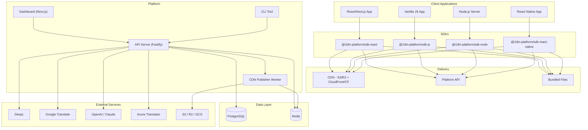
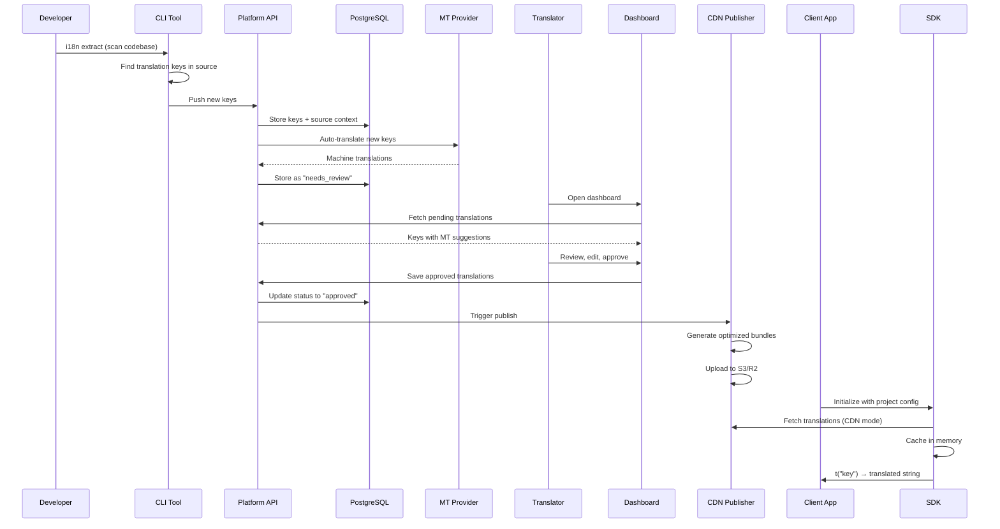
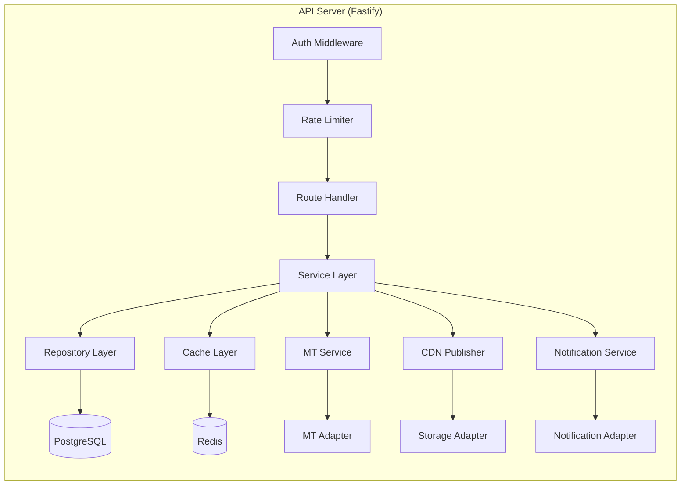
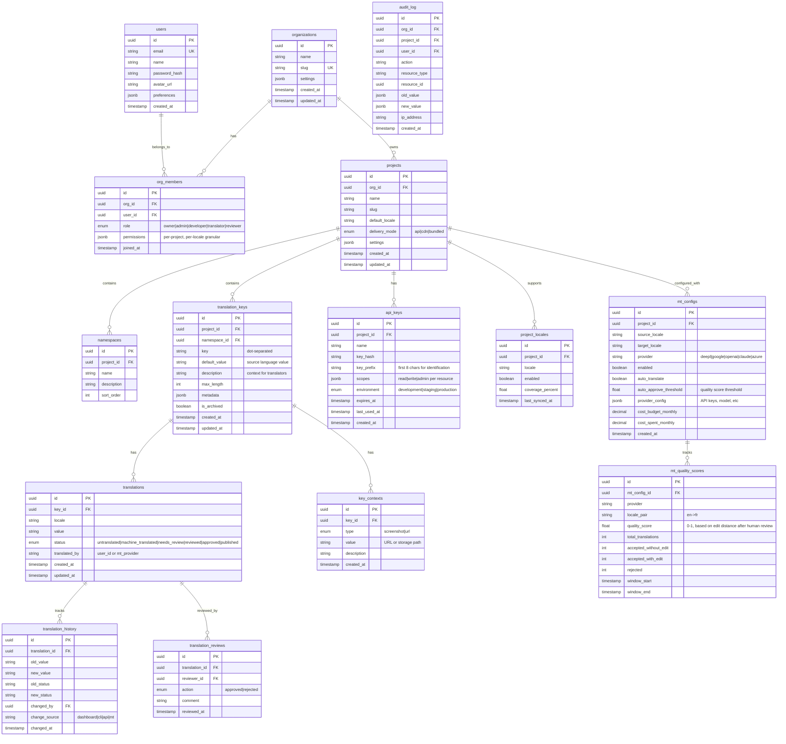
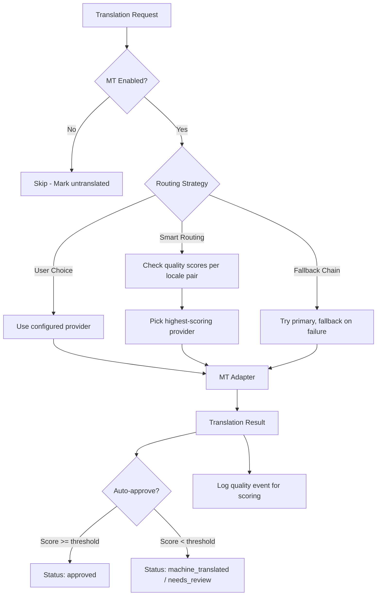

# i18n Automation Platform — Design Spec

**Date:** 2026-03-31
**Project:** #36 from Master Plan — `i18n-platform/`
**Status:** Design Approved

---

## 1. Vision & Goals

A **self-hosted, full-stack i18n platform** — the open-source alternative to Crowdin/Lokalise. It provides a web dashboard for translators, SDKs for every runtime, a CLI for developer workflows, and AI-powered machine translation with quality learning.

### Target Users

1. **Ayush's own projects** — all 40 master plan projects plug into this central platform
2. **Freelance clients** — deploy per-client with their own org/projects
3. **Dev teams** — sell/open-source as a self-hosted product for teams wanting full control
4. **Translators** — non-technical users manage translations through the dashboard

### Success Criteria

- Any project can integrate i18n in under 10 minutes via SDK + CLI
- Translators can work independently without developer involvement
- Zero runtime dependency option (build-time bundling)
- AI auto-translation reduces manual work by 60-80%
- Supports 2-200+ languages per project
- Full audit trail of every translation change

---

## 2. Architecture Overview

### Approach: Modular Monorepo

A **pnpm + Turborepo** monorepo with independently publishable packages. Each package has clean boundaries, its own tests, and communicates through well-defined interfaces defined in `@i18n-platform/core`.

### High-Level Architecture



### Data Flow



---

## 3. Repository Structure

```
i18n-platform/
├── packages/
│   ├── core/                  — Shared types, interfaces, adapters, validation
│   ├── sdk-react/             — React/Next.js hooks, components, providers
│   ├── sdk-js/                — Framework-agnostic browser SDK
│   ├── sdk-node/              — Node.js server SDK
│   ├── sdk-react-native/      — React Native SDK
│   ├── cli/                   — CLI tool (extract, push, pull, sync, validate)
│   ├── api/                   — REST API server (Fastify)
│   ├── dashboard/             — Next.js web dashboard
│   └── database/              — Drizzle ORM schema, migrations, seed
├── apps/
│   └── cdn-publisher/         — Worker that publishes translations to CDN
├── examples/
│   ├── nextjs-app-router/     — Next.js 15 App Router with SSR/SSG
│   ├── nextjs-pages-router/   — Next.js Pages Router
│   ├── react-vite-spa/        — Vite + React SPA
│   ├── express-server/        — Express.js backend translations
│   ├── fastify-server/        — Fastify backend translations
│   ├── react-native-expo/     — Expo React Native app
│   ├── vanilla-html/          — Plain HTML + script tag
│   ├── email-templates/       — React Email i18n integration
│   └── pdf-generation/        — React-PDF i18n integration
├── docs/
│   ├── HLD.md                 — High-Level Design document
│   ├── LLD.md                 — Low-Level Design document
│   ├── architecture/          — Mermaid diagrams (exported)
│   ├── guides/
│   │   ├── getting-started.md
│   │   ├── sdk-react.md
│   │   ├── sdk-js.md
│   │   ├── sdk-node.md
│   │   ├── sdk-react-native.md
│   │   ├── cli.md
│   │   ├── dashboard.md
│   │   ├── machine-translation.md
│   │   ├── deployment.md
│   │   └── self-hosting.md
│   └── api-reference/         — OpenAPI/Swagger generated docs
├── k6/                        — K6 load/performance test scripts
├── docker-compose.yml
├── docker-compose.prod.yml
├── Dockerfile.api
├── Dockerfile.dashboard
├── Dockerfile.cdn-publisher
├── turbo.json
├── pnpm-workspace.yaml
├── .env.example
├── .github/
│   └── workflows/
│       ├── ci.yml             — Lint, typecheck, test on PR
│       ├── release.yml        — Publish npm packages
│       └── deploy.yml         — Deploy API + dashboard
└── CLAUDE.md
```

---

## 4. Package Designs

### 4.1 `@i18n-platform/core`

The foundational package. Defines all interfaces, types, and shared logic. Zero runtime dependencies beyond Zod for validation.

#### Adapter Interfaces

Every external integration follows the adapter pattern. Consumers depend on interfaces, never concrete implementations.

**`IFormatAdapter`** — Parse and serialize translation files:

```typescript
interface IFormatAdapter {
  readonly formatId: string;
  readonly fileExtension: string;
  parse(content: string): TranslationMap;
  serialize(translations: TranslationMap, options?: SerializeOptions): string;
  detect(content: string): boolean;
}
```

Implementations: `JsonFlatAdapter`, `JsonNestedAdapter`, `YamlAdapter`, `PoAdapter`, `XliffAdapter`, `AndroidXmlAdapter`, `IosStringsAdapter`

**`ITranslationProvider`** — How SDKs fetch translations at runtime:

```typescript
interface ITranslationProvider {
  readonly providerId: string;
  load(locale: Locale, namespace?: string): Promise<TranslationMap>;
  onChange?(callback: (locale: Locale) => void): Unsubscribe;
}
```

Implementations: `ApiProvider`, `CdnProvider`, `BundledProvider`

**`IMachineTranslator`** — MT providers:

```typescript
interface IMachineTranslator {
  readonly providerId: string;
  readonly supportedLanguages: Locale[];
  translate(params: TranslateParams): Promise<TranslateResult>;
  translateBatch(params: TranslateBatchParams): Promise<TranslateBatchResult>;
  detectLanguage?(text: string): Promise<Locale>;
  estimateCost?(params: TranslateParams): Promise<CostEstimate>;
}
```

Implementations: `DeepLAdapter`, `GoogleTranslateAdapter`, `OpenAIAdapter`, `ClaudeAdapter`, `AzureTranslatorAdapter`, `NoOpAdapter` (disabled MT)

**`IStorageAdapter`** — CDN/file storage:

```typescript
interface IStorageAdapter {
  readonly storageId: string;
  upload(key: string, content: Buffer | string, contentType: string): Promise<UploadResult>;
  download(key: string): Promise<Buffer>;
  delete(key: string): Promise<void>;
  getPublicUrl(key: string): string;
  list(prefix: string): Promise<StorageObject[]>;
}
```

Implementations: `S3Adapter`, `R2Adapter`, `GcsAdapter`, `LocalFsAdapter`

**`ICacheAdapter`** — Caching:

```typescript
interface ICacheAdapter {
  get<T>(key: string): Promise<T | null>;
  set<T>(key: string, value: T, ttlMs?: number): Promise<void>;
  delete(key: string): Promise<void>;
  invalidatePattern(pattern: string): Promise<void>;
}
```

Implementations: `RedisAdapter`, `InMemoryAdapter`

**`INotificationAdapter`** — Event notifications:

```typescript
interface INotificationAdapter {
  readonly channelId: string;
  send(notification: Notification): Promise<void>;
}
```

Implementations: `EmailAdapter`, `SlackAdapter`, `WebhookAdapter`

**`IKeyExtractor`** — Extract translation keys from source code:

```typescript
interface IKeyExtractor {
  readonly extractorId: string;
  readonly supportedFileTypes: string[];
  extract(sourceCode: string, filePath: string): ExtractionResult;
}
```

Implementations: `ReactExtractor` (finds `t()`, `<Trans>`, `useTranslation`), `VanillaJsExtractor`, `NodeExtractor`

#### Core Types

```typescript
/** Represents a BCP-47 locale identifier */
type Locale = string; // e.g., "en-US", "fr-FR", "hi-IN"

/** A dot-separated translation key */
type TranslationKey = string; // e.g., "auth.login.title"

/** A flat map of keys to translation values */
type TranslationMap = Record<TranslationKey, TranslationValue>;

/** A translation value supporting interpolation and pluralization */
interface TranslationValue {
  value: string;
  pluralForms?: Record<PluralCategory, string>;
  context?: string; // disambiguation context
  description?: string; // for translators
  maxLength?: number; // UI constraint
  screenshots?: string[]; // URLs to context screenshots
}

type PluralCategory = "zero" | "one" | "two" | "few" | "many" | "other";

/** Translation status lifecycle */
type TranslationStatus =
  | "untranslated"
  | "machine_translated"
  | "needs_review"
  | "reviewed"
  | "approved"
  | "published";

/** Namespace for grouping keys */
interface Namespace {
  id: string;
  name: string; // e.g., "common", "auth", "dashboard"
  projectId: string;
}
```

#### Validation (Zod Schemas)

All API payloads, config files, and translation formats validated with Zod. Schemas exported for use across CLI, API, and dashboard.

```typescript
const ProjectConfigSchema = z.object({
  projectId: z.string().uuid(),
  defaultLocale: z.string(),
  supportedLocales: z.array(z.string()).min(1),
  namespaces: z.array(z.string()).default(["common"]),
  delivery: z.enum(["api", "cdn", "bundled"]),
  machineTranslation: MachineTranslationConfigSchema.optional(),
  formatting: FormattingConfigSchema.optional(),
});
```

---

### 4.2 `@i18n-platform/sdk-react`

React/Next.js SDK with hooks, components, and providers.

#### API Surface

```typescript
// Provider — wraps app, configures locale and translation loading
<I18nProvider config={config} initialLocale="en">
  <App />
</I18nProvider>

// Hook — the primary translation API
const { t, locale, setLocale, isLoading } = useTranslation("namespace");
t("auth.login.title"); // → "Sign In"
t("greeting", { name: "Ayush" }); // → "Hello, Ayush"
t("items.count", { count: 5 }); // → "5 items" (pluralized)

// Component — for rich text with JSX interpolation
<Trans i18nKey="welcome" components={{ bold: <strong />, link: <a href="/..." /> }} />

// Locale switcher component
<LocaleSwitcher />

// Next.js specific
// - App Router: Server Component support via async `getTranslations()`
// - SSR/SSG: Pre-load translations at build time or request time
// - Middleware: Auto-detect locale from headers, cookies, URL
```

#### Features

- **Lazy loading** — Load translations per namespace on demand
- **SSR/SSG support** — Pre-load translations server-side, hydrate client-side
- **Suspense support** — `<Suspense>` boundaries while translations load
- **Hot reload** — In dev mode, translations update without page refresh
- **Type safety** — Generated TypeScript types for translation keys (via CLI)
- **Interpolation** — `{variable}`, `{count, plural, ...}`, `{date, date, short}`
- **ICU MessageFormat** — Full ICU message syntax support
- **RTL support** — Automatic dir="rtl" for RTL locales
- **Context** — Same key, different translations based on context (e.g., gender)

---

### 4.3 `@i18n-platform/sdk-js`

Framework-agnostic browser SDK. No React dependency.

```typescript
import { createI18n } from "@i18n-platform/sdk-js";

const i18n = createI18n({
  projectId: "...",
  defaultLocale: "en",
  delivery: "cdn",
  cdnUrl: "https://cdn.example.com/i18n",
});

await i18n.init();
i18n.t("greeting", { name: "World" }); // → "Hello, World"
await i18n.setLocale("fr");
i18n.t("greeting", { name: "World" }); // → "Bonjour, World"
i18n.on("localeChange", (locale) => { /* re-render UI */ });
```

- Works in any browser environment (vanilla, Vue, Svelte, Angular, Web Components)
- Event emitter for locale changes
- Same interpolation/pluralization as React SDK (shared core logic)

---

### 4.4 `@i18n-platform/sdk-node`

Server-side SDK for Node.js backends.

```typescript
import { createI18nServer } from "@i18n-platform/sdk-node";

const i18n = await createI18nServer({
  projectId: "...",
  delivery: "api", // or "bundled"
  cacheAdapter: new RedisAdapter(redisClient),
});

// Per-request translation (Express/Fastify middleware)
app.use(i18n.middleware()); // detects locale from Accept-Language header

// In route handlers
req.t("email.welcome.subject"); // → "Welcome to our platform"

// Direct use (for emails, PDFs, cron jobs)
const t = await i18n.getTranslator("fr-FR");
t("invoice.total", { amount: "€99.00" }); // → "Total: €99.00"
```

- Express and Fastify middleware adapters
- Request-scoped locale detection (header, cookie, query param)
- Pre-loaded translations with background refresh
- Thread-safe (no global state)

---

### 4.5 `@i18n-platform/sdk-react-native`

React Native SDK, extending the React SDK with mobile-specific features.

```typescript
import { I18nProvider, useTranslation } from "@i18n-platform/sdk-react-native";

// Same hooks API as sdk-react
const { t, locale, setLocale } = useTranslation();

// Mobile-specific
// - AsyncStorage-based caching (offline support)
// - Respects device locale settings
// - OTA translation updates (no app store deploy needed)
// - Bundle translations in app binary as fallback
```

---

### 4.6 `@i18n-platform/cli`

Developer CLI for extraction, sync, and validation.

```bash
# Initialize project config
i18n init

# Extract keys from source code
i18n extract --source ./src --format react
# Scans for t(), useTranslation(), <Trans> etc.
# Outputs new/changed/removed keys

# Push keys to platform
i18n push

# Pull translations from platform
i18n pull --locale fr,de,ja --format json-nested --output ./public/locales

# Sync (push keys + pull translations)
i18n sync

# Validate translations
i18n validate
# Checks: missing keys, unused keys, interpolation mismatches,
# plural form completeness, max length violations

# Generate TypeScript types from keys
i18n codegen --output ./src/i18n/types.ts

# Machine translate (trigger from CLI)
i18n translate --locale fr,de --provider deepl

# Status report
i18n status
# Shows: % translated per locale, pending reviews, recent changes

# Diff — show what changed since last sync
i18n diff

# CI mode — exits with non-zero if translations incomplete
i18n ci --min-coverage 95
```

**Config file: `i18n.config.ts`**

```typescript
import { defineConfig } from "@i18n-platform/cli";

export default defineConfig({
  projectId: "proj_abc123",
  apiUrl: "https://i18n.example.com/api",
  apiKey: "${I18N_API_KEY}", // from env
  defaultLocale: "en",
  supportedLocales: ["en", "fr", "de", "ja", "hi"],
  source: {
    paths: ["./src"],
    extractors: ["react", "vanilla-js"],
    ignore: ["**/*.test.*", "**/node_modules/**"],
  },
  output: {
    path: "./public/locales",
    format: "json-nested",
    splitByNamespace: true,
  },
  delivery: "cdn",
  machineTranslation: {
    enabled: true,
    provider: "deepl",
    autoTranslateOnPush: true,
  },
  validation: {
    missingKeys: "error",
    unusedKeys: "warn",
    interpolationMismatch: "error",
    minCoverage: 95,
  },
});
```

---

### 4.7 `@i18n-platform/api`

Fastify REST API server. The central hub everything talks to.

#### API Endpoints

**Organizations**
- `POST   /api/v1/orgs` — Create organization
- `GET    /api/v1/orgs` — List user's organizations
- `GET    /api/v1/orgs/:orgId` — Get organization
- `PATCH  /api/v1/orgs/:orgId` — Update organization
- `DELETE /api/v1/orgs/:orgId` — Delete organization

**Members & Roles**
- `POST   /api/v1/orgs/:orgId/members/invite` — Invite member
- `GET    /api/v1/orgs/:orgId/members` — List members
- `PATCH  /api/v1/orgs/:orgId/members/:userId` — Update role/permissions
- `DELETE /api/v1/orgs/:orgId/members/:userId` — Remove member

**Projects**
- `POST   /api/v1/orgs/:orgId/projects` — Create project
- `GET    /api/v1/orgs/:orgId/projects` — List projects
- `GET    /api/v1/projects/:projectId` — Get project
- `PATCH  /api/v1/projects/:projectId` — Update project settings
- `DELETE /api/v1/projects/:projectId` — Delete project

**Translation Keys**
- `POST   /api/v1/projects/:projectId/keys` — Create key(s) (bulk)
- `GET    /api/v1/projects/:projectId/keys` — List keys (paginated, filterable)
- `GET    /api/v1/projects/:projectId/keys/:keyId` — Get key with all translations
- `PATCH  /api/v1/projects/:projectId/keys/:keyId` — Update key metadata
- `DELETE /api/v1/projects/:projectId/keys/:keyId` — Delete key
- `POST   /api/v1/projects/:projectId/keys/extract` — CLI pushes extracted keys

**Translations**
- `GET    /api/v1/projects/:projectId/translations/:locale` — Get all translations for locale
- `PUT    /api/v1/projects/:projectId/translations/:locale/:keyId` — Set translation
- `PATCH  /api/v1/projects/:projectId/translations/bulk` — Bulk update translations
- `GET    /api/v1/projects/:projectId/translations/:locale/export` — Export in any format

**Translation Workflow**
- `POST   /api/v1/projects/:projectId/translations/:locale/:keyId/review` — Submit for review
- `POST   /api/v1/projects/:projectId/translations/:locale/:keyId/approve` — Approve translation
- `POST   /api/v1/projects/:projectId/translations/:locale/:keyId/reject` — Reject with comment
- `POST   /api/v1/projects/:projectId/translations/publish` — Publish approved to CDN

**Machine Translation**
- `POST   /api/v1/projects/:projectId/mt/translate` — Translate keys via MT
- `GET    /api/v1/projects/:projectId/mt/config` — Get MT config
- `PUT    /api/v1/projects/:projectId/mt/config` — Update MT config (provider, routing rules)
- `GET    /api/v1/projects/:projectId/mt/quality` — Quality scores per provider/locale

**Context & Screenshots**
- `POST   /api/v1/projects/:projectId/keys/:keyId/context` — Attach screenshot/URL
- `GET    /api/v1/projects/:projectId/keys/:keyId/context` — Get context for key
- `DELETE /api/v1/projects/:projectId/keys/:keyId/context/:contextId` — Remove context

**Import/Export**
- `POST   /api/v1/projects/:projectId/import` — Import translation file (any format)
- `GET    /api/v1/projects/:projectId/export` — Export all translations (any format)

**Statistics & Audit**
- `GET    /api/v1/projects/:projectId/stats` — Translation coverage stats
- `GET    /api/v1/projects/:projectId/audit` — Audit log (who changed what)
- `GET    /api/v1/orgs/:orgId/stats` — Org-wide statistics

**SDK Delivery**
- `GET    /api/v1/sdk/:projectId/:locale` — SDK translation endpoint (cached, fast)
- `GET    /api/v1/sdk/:projectId/:locale/:namespace` — Per-namespace endpoint

**API Keys**
- `POST   /api/v1/projects/:projectId/api-keys` — Create scoped API key
- `GET    /api/v1/projects/:projectId/api-keys` — List API keys
- `DELETE /api/v1/projects/:projectId/api-keys/:keyId` — Revoke API key

#### Architecture



**Layered architecture:**
- **Routes** — HTTP handling, request validation (Zod), response serialization
- **Services** — Business logic, orchestration, no direct DB access
- **Repositories** — Data access, Drizzle queries, caching
- **Adapters** — External service integrations (MT, storage, notifications)

---

### 4.8 `@i18n-platform/dashboard`

Next.js 15 web application for managing translations.

#### Pages & Features

**Auth**
- Login (email/password, OAuth)
- Register, forgot password
- Org invitation accept

**Organization**
- Org settings, billing (future), usage
- Member management, role assignment
- API key management

**Projects**
- Project list with coverage stats
- Project settings (locales, namespaces, MT config, delivery config)
- Project creation wizard

**Translation Editor**
- Key list view — filterable by namespace, locale, status, search
- Grid view — spreadsheet-like, all locales side by side
- Single key view — all locales, context, screenshots, history
- Inline editing with auto-save
- MT suggestions shown alongside empty/machine-translated fields
- Bulk actions (approve all, translate all, export selection)
- Keyboard shortcuts for power users (Tab through fields, Ctrl+Enter to approve)

**Review Workflow**
- Review queue — translations pending review per locale
- Side-by-side: source (default locale) vs translation
- Approve / reject with comment
- Batch approve

**Context & Screenshots**
- Upload screenshots per key
- Link URLs per key
- Visual context shown in translation editor

**Import/Export**
- Upload translation files (drag & drop, any supported format)
- Auto-detect format
- Conflict resolution (skip, overwrite, keep newer)
- Export in any format, with filters

**Statistics Dashboard**
- Per-project: coverage % per locale, translation velocity, MT vs human ratio
- Per-org: aggregate stats, active translators, keys growth
- Charts: coverage over time, translation activity heatmap

**Audit Log**
- Who changed what, when
- Filter by user, project, key, action
- Diff view for translation changes

**Settings**
- Machine translation configuration per project
  - Enable/disable per locale
  - Provider selection per language pair
  - Auto-translate on key creation toggle
  - Quality threshold for auto-approve
  - Cost budget limits
- Notification preferences
- Webhook configuration

---

### 4.9 `@i18n-platform/database`

Drizzle ORM schema and migrations.

#### Schema Overview



---

### 4.10 `apps/cdn-publisher`

A background worker that listens for publish events and generates optimized translation bundles for CDN delivery.

**Process:**
1. Receives publish trigger (via Redis pub/sub or BullMQ job)
2. Fetches all approved translations for the project
3. Generates bundles per locale, optionally per namespace
4. Minifies and compresses (gzip + brotli)
5. Uploads to configured storage (S3/R2/GCS) via `IStorageAdapter`
6. Invalidates CDN cache
7. Updates `project_locales.last_synced_at`

**Bundle format:**
```
/i18n/{projectId}/{version}/{locale}.json
/i18n/{projectId}/{version}/{locale}/{namespace}.json
/i18n/{projectId}/latest/{locale}.json  (symlink/redirect to current version)
```

Versioned bundles ensure clients can pin to a version. `latest/` always points to the most recent publish.

---

## 5. Machine Translation System

### Architecture



### Configuration (per project, per locale pair)

```typescript
interface MachineTranslationConfig {
  enabled: boolean; // global kill switch
  defaultProvider: string; // fallback provider
  autoTranslateOnKeyCreate: boolean;
  routing: {
    strategy: "user_choice" | "smart" | "fallback_chain";
    rules: Array<{
      sourceLocale: string;
      targetLocale: string;
      provider: string;
      priority: number; // for fallback chain
    }>;
  };
  autoApprove: {
    enabled: boolean;
    qualityThreshold: number; // 0-1, e.g., 0.85
  };
  costLimits: {
    monthlyBudget: number; // USD
    perRequestLimit: number;
    alertThreshold: number; // % of budget, trigger notification
  };
}
```

### Quality Scoring

When a translator reviews an MT-produced translation:
- **Accepted without edit** → quality +1.0
- **Accepted with minor edit** (Levenshtein distance < 20%) → quality +0.7
- **Accepted with major edit** (distance >= 20%) → quality +0.3
- **Rejected** → quality +0.0

Scores are aggregated per provider per language pair in rolling 30-day windows. Smart routing uses these scores to pick the best provider.

---

## 6. Access Control & Multi-Tenancy

### Tenant Model

```
Organization (tenant boundary)
├── Members (users with org-level roles)
├── Projects
│   ├── Project-level permissions (per member, per locale)
│   └── API Keys (scoped per environment)
└── Settings (org-wide defaults)
```

### Roles & Permissions

| Role | Org-Level | Project-Level |
|------|-----------|---------------|
| **Owner** | Full control, billing, delete org | Full control on all projects |
| **Admin** | Manage members, create projects | Full control on assigned projects |
| **Developer** | View projects | Push/pull keys, import/export, view translations |
| **Translator** | View assigned projects | Edit translations for assigned locales only |
| **Reviewer** | View assigned projects | Approve/reject translations for assigned locales |

### Granular Permissions

Permissions are stored as JSONB on `org_members`:

```typescript
interface MemberPermissions {
  projects: {
    [projectId: string]: {
      role: "admin" | "developer" | "translator" | "reviewer";
      locales: string[] | "*"; // which locales they can work with
      namespaces: string[] | "*"; // which namespaces they can access
    };
  };
}
```

### API Key Scoping

```typescript
interface ApiKeyScopes {
  environment: "development" | "staging" | "production";
  permissions: {
    translations: "read" | "read_write";
    keys: "read" | "read_write";
    import_export: boolean;
    mt: boolean;
    publish: boolean;
  };
}
```

---

## 7. Tech Stack

| Layer | Technology |
|-------|-----------|
| **Monorepo** | pnpm workspaces + Turborepo |
| **Language** | TypeScript (strict mode) everywhere |
| **API Server** | Fastify |
| **Dashboard** | Next.js 15 (App Router) |
| **Database** | PostgreSQL 16 |
| **ORM** | Drizzle ORM |
| **Cache/Queue** | Redis + BullMQ |
| **Validation** | Zod |
| **Auth** | JWT (short-lived access + long-lived refresh tokens, HTTP-only cookies for dashboard, Bearer header for API/SDK), OAuth 2.0 (Google, GitHub) via PKCE flow |
| **UI Components** | Tailwind CSS + Radix UI + shadcn/ui |
| **Charts** | Recharts |
| **Rich Text** | Tiptap (for key descriptions with formatting) |
| **File Storage** | S3/R2/GCS via adapter |
| **Email** | React Email + Resend (via adapter) |
| **CLI** | Commander.js + Inquirer + chalk + ora |
| **Testing** | Vitest (unit/integration) + Playwright (E2E) + K6 (perf) |
| **API Docs** | OpenAPI/Swagger (auto-generated from Fastify schemas) |
| **CI/CD** | GitHub Actions |
| **Containerization** | Docker + docker-compose |
| **Linting** | ESLint + Prettier |
| **Build** | tsup (packages), Next.js (dashboard), esbuild (CLI) |

---

## 8. Testing Strategy

### Per-Package Testing

| Package | Unit | Integration | E2E | K6 |
|---------|------|-------------|-----|-----|
| `core` | All adapters, validators, types | Format round-trips, adapter contracts | — | — |
| `sdk-react` | Hooks, components, providers | SSR rendering, hydration | — | — |
| `sdk-js` | Translation engine, interpolation, pluralization | Provider loading, caching | — | — |
| `sdk-node` | Middleware, translator | Express/Fastify integration | — | — |
| `sdk-react-native` | Hooks, storage | AsyncStorage caching | — | — |
| `cli` | Extractors, config parsing, diff | Push/pull against test API | Full workflow | — |
| `api` | Service layer, repositories | API endpoint tests with real DB | Full user flows | Load testing all endpoints |
| `dashboard` | Components, forms, state | Page rendering, API integration | Full translator workflow | — |
| `database` | Schema validation | Migrations up/down, seed | — | — |
| `cdn-publisher` | Bundle generation, compression | Upload to mocked storage | Publish flow | — |

### Testing Principles

1. **Fix production bugs, don't just pass tests** — If a test reveals a problem, fix the actual issue
2. **Real database for integration tests** — No mocking PostgreSQL or Redis
3. **Contract tests for adapters** — Every adapter implementation must pass the same interface test suite
4. **K6 performance benchmarks:**
   - SDK `t()` call: < 0.1ms
   - API translation fetch: < 50ms p95
   - CDN delivery: < 20ms p95
   - Bulk key push (1000 keys): < 2s
   - Dashboard page load: < 1s
5. **CI gates:** All tests must pass, coverage > 80%, no performance regressions

---

## 9. Deployment

### Docker Compose (Local Dev)

```yaml
services:
  api:        # Fastify API server
  dashboard:  # Next.js dashboard
  publisher:  # CDN publisher worker
  postgres:   # PostgreSQL 16
  redis:      # Redis 7
  minio:      # S3-compatible storage (local)
  mailpit:    # Email testing
```

`docker-compose up` → entire platform running locally.

### Production Options

1. **Docker** — `docker-compose.prod.yml` with all services
2. **Vercel + Docker** — Dashboard on Vercel, API + publisher as Docker containers
3. **Self-hosted** — Full Docker deployment on any VPS/cloud

### Environment Configuration

All config via environment variables, documented in `.env.example`:

```env
# Database
DATABASE_URL=postgresql://...
REDIS_URL=redis://...

# Auth
JWT_SECRET=...
OAUTH_GOOGLE_CLIENT_ID=...
OAUTH_GOOGLE_CLIENT_SECRET=...
OAUTH_GITHUB_CLIENT_ID=...
OAUTH_GITHUB_CLIENT_SECRET=...

# Storage (adapter: s3 | r2 | gcs | local)
STORAGE_ADAPTER=s3
S3_BUCKET=...
S3_REGION=...
S3_ACCESS_KEY=...
S3_SECRET_KEY=...

# Machine Translation (all optional — user configures per project)
DEEPL_API_KEY=...
GOOGLE_TRANSLATE_API_KEY=...
OPENAI_API_KEY=...
ANTHROPIC_API_KEY=...
AZURE_TRANSLATOR_KEY=...

# Email (adapter: resend | sendgrid)
EMAIL_ADAPTER=resend
RESEND_API_KEY=...

# CDN
CDN_BASE_URL=https://cdn.example.com/i18n
```

---

## 10. Non-Functional Requirements

| Requirement | Target |
|-------------|--------|
| **API Response Time** | p95 < 100ms for reads, < 500ms for writes |
| **SDK `t()` Performance** | < 0.1ms per call (in-memory lookup) |
| **CDN Latency** | < 30ms globally |
| **Concurrent Users** | 100+ translators simultaneously |
| **Translation Keys** | Support 100,000+ keys per project |
| **Locales** | Support 200+ locales per project |
| **Uptime** | 99.9% for API, CDN has higher via provider SLA |
| **Data Integrity** | Full audit log, soft deletes, point-in-time recovery |
| **Security** | OWASP top 10 addressed, rate limiting, input validation |

---

## 11. Scope Boundaries

### In Scope (v1)

- Full monorepo with all packages
- Dashboard with translation editor, review workflow, stats
- CLI with extract, push, pull, sync, validate, codegen
- SDKs for React, Vanilla JS, Node.js, React Native
- 7 format adapters (JSON flat, JSON nested, YAML, PO, XLIFF, Android XML, iOS Strings)
- 5 MT provider adapters (DeepL, Google, OpenAI, Claude, Azure)
- Multi-tenant access control with granular permissions
- CDN publishing with versioning
- API delivery and build-time bundling
- Manual screenshot/URL context attachment
- Quality scoring for MT providers
- Full test suite (unit, integration, E2E, K6)
- Docker Compose local dev + production deployment
- Comprehensive documentation with examples

### Out of Scope (Future)

- Automated screenshot capture via CI (architecture supports it, not implemented)
- In-context editing (live overlay on running app)
- Translation memory (cross-project reuse of similar translations)
- Glossary / terminology management
- Billing/subscription for SaaS mode
- SSO (SAML/OIDC) — basic OAuth only in v1
- Branching/versioning of translation sets (git-like)
- Webhook triggers to external systems on translation events
- Mobile app for translators
